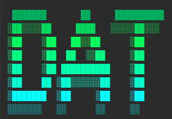
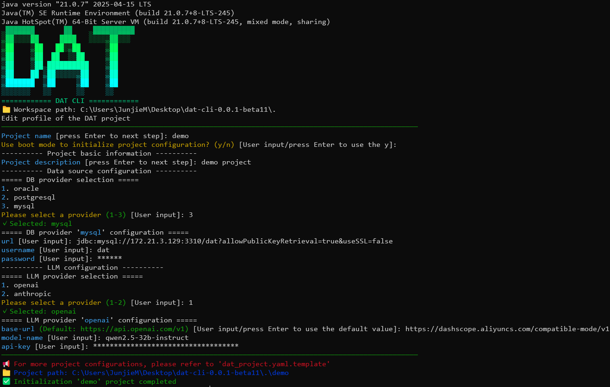
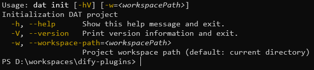
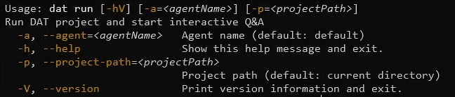
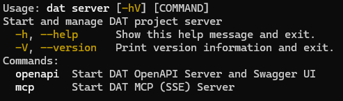
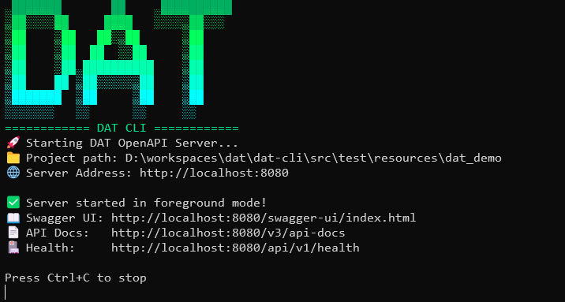
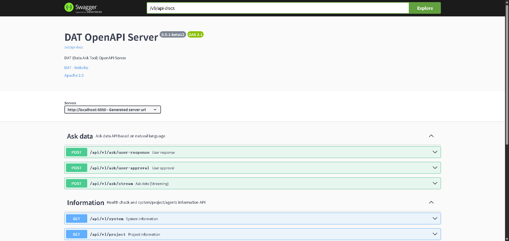
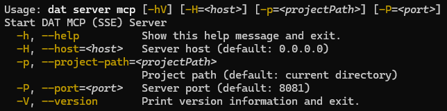
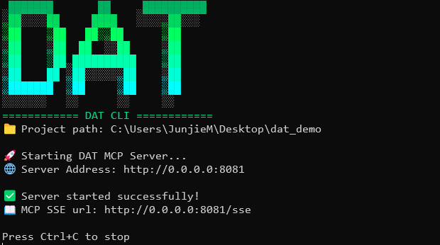
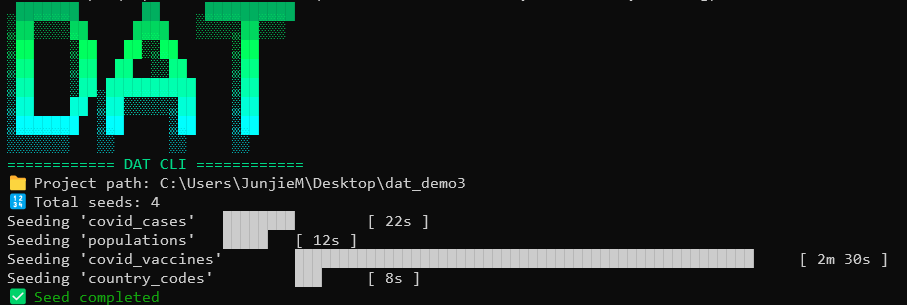

<div align="center">

# 🚀 DAT (Data Ask Tool)

**Enterprise-grade AI Tool for Conversing with Data Using Natural Language**

*Dating with your data*

[](https://github.com/hexinfo/dat/releases/latest)
[](https://github.com/hexinfo/dat)
[](https://github.com/hexinfo/dat/releases/latest)
[](https://github.com/hexinfo/dat/blob/main/LICENSE)
[](https://openjdk.java.net/projects/jdk/17/)
[](https://maven.apache.org/)
[](https://deepwiki.com/hexinfo/dat)
[![zread](https://img.shields.io/badge/Ask_Zread-_.svg?style=flat&color=00b0aa&labelColor=000000&logo=data%3Aimage%2Fsvg%2Bxml%3Bbase64%2CPHN2ZyB3aWR0aD0iMTYiIGhlaWdodD0iMTYiIHZpZXdCb3g9IjAgMCAxNiAxNiIgZmlsbD0ibm9uZSIgeG1sbnM9Imh0dHA6Ly93d3cudzMub3JnLzIwMDAvc3ZnIj4KPHBhdGggZD0iTTQuOTYxNTYgMS42MDAxSDIuMjQxNTZDMS44ODgxIDEuNjAwMSAxLjYwMTU2IDEuODg2NjQgMS42MDE1NiAyLjI0MDFWNC45NjAxQzEuNjAxNTYgNS4zMTM1NiAxLjg4ODEgNS42MDAxIDIuMjQxNTYgNS42MDAxSDQuOTYxNTZDNS4zMTUwMiA1LjYwMDEgNS42MDE1NiA1LjMxMzU2IDUuNjAxNTYgNC45NjAxVjIuMjQwMUM1LjYwMTU2IDEuODg2NjQgNS4zMTUwMiAxLjYwMDEgNC45NjE1NiAxLjYwMDFaIiBmaWxsPSIjZmZmIi8%2BCjxwYXRoIGQ9Ik00Ljk2MTU2IDEwLjM5OTlIMi4yNDE1NkMxLjg4ODEgMTAuMzk5OSAxLjYwMTU2IDEwLjY4NjQgMS42MDE1NiAxMS4wMzk5VjEzLjc1OTlDMS42MDE1NiAxNC4xMTM0IDEuODg4MSAxNC4zOTk5IDIuMjQxNTYgMTQuMzk5OUg0Ljk2MTU2QzUuMzE1MDIgMTQuMzk5OSA1LjYwMTU2IDE0LjExMzQgNS42MDE1NiAxMy43NTk5VjExLjAzOTlDNS42MDE1NiAxMC42ODY0IDUuMzE1MDIgMTAuMzk5OSA0Ljk2MTU2IDEwLjM5OTlaIiBmaWxsPSIjZmZmIi8%2BCjxwYXRoIGQ9Ik0xMy43NTg0IDEuNjAwMUgxMS4wMzg0QzEwLjY4NSAxLjYwMDEgMTAuMzk4NCAxLjg4NjY0IDEwLjM5ODQgMi4yNDAxVjQuOTYwMUMxMC4zOTg0IDUuMzEzNTYgMTAuNjg1IDUuNjAwMSAxMS4wMzg0IDUuNjAwMUgxMy43NTg0QzE0LjExMTkgNS42MDAxIDE0LjM5ODQgNS4zMTM1NiAxNC4zOTg0IDQuOTYwMVYyLjI0MDFDMTQuMzk4NCAxLjg4NjY0IDE0LjExMTkgMS42MDAxIDEzLjc1ODQgMS42MDAxWiIgZmlsbD0iI2ZmZiIvPgo8cGF0aCBkPSJNNCAxMkwxMiA0TDQgMTJaIiBmaWxsPSIjZmZmIi8%2BCjxwYXRoIGQ9Ik00IDEyTDEyIDQiIHN0cm9rZT0iI2ZmZiIgc3Ryb2tlLXdpZHRoPSIxLjUiIHN0cm9rZS1saW5lY2FwPSJyb3VuZCIvPgo8L3N2Zz4K&logoColor=ffffff)](https://zread.ai/hexinfo/dat)



</div>

---

> **[🇨🇳 中文版本](./README.md)**

---

## 🎯 Project Vision

> We are entering a new era of generative artificial intelligence, where **language is the interface, and data is the fuel**.

DAT is dedicated to solving the last-mile problem of enterprise data querying — enabling business users to converse directly with databases using natural language, without writing complex SQL queries. Through a pre-modeled semantic layer, DAT ensures that AI can express itself not only confidently but also correctly.

The core driving force of DAT does not entirely stem from another intelligence explosion of large language models themselves, but rather from the Askdata Agent workflow we designed for it.
Everything we do is essentially trading `"more precise and complete knowledge"` (**currently the main development focus**), `"more computational steps"`, and `"longer thinking time"` for something crucial in the real business world — the `"high quality"` and `"certainty"` of results.


## ✨ Core Features

### 🏗️ Enterprise-grade Architecture Design
- **🔌 Pluggable SPI Architecture** - Flexible extension support for multiple databases, LLMs, and embedding models
- **🏭 Factory Pattern Implementation** - Standardized component creation and management mechanism
- **📦 Modular Design** - Clear separation of responsibilities for easy maintenance and extension

### 🗃️ Multi-database Support
- **MySQL** - Full support including connection pooling and dialect conversion
- **PostgreSQL** - Enterprise-grade database support
- **Oracle** - Legacy enterprise database compatibility
- **More Databases** - Easily extensible through SPI mechanism

### 🤖 Intelligent Semantic SQL Generation
- **Natural Language Understanding** - LLM-based semantic parsing
- **SQL Dialect Conversion** - Automatic adaptation to different database syntaxes
- **Semantic Model Binding** - Query accuracy ensured through predefined models

### 📊 Rich Semantic Modeling
- **Entities** - Primary key and foreign key relationship definitions
- **Dimensions** - Time, categorical, and enumeration dimension support
- **Measures** - Aggregation functions and calculated field definitions
- **YAML Configuration** - Intuitive model definition approach

### 🔍 Vector-enhanced Retrieval
- **Content Storage** - Vectorization of SQL Q&A pairs, synonyms, and business knowledge
- **Semantic Retrieval** - Intelligent matching based on embedding models
- **Multiple Storage Backends** - Storage options including DuckDB, Weaviate, PGVector, etc.


---

## 🏗️ System Architecture

```
┌─────────────────────────────────────────────────────────────┐
│                        DAT Framework                        │
├─────────────────────────────────────────────────────────────┤
│  🎯 DAT Language (Authoring Layer)                          │
│  ├── 📝 Semantic Model Definition (YAML)                    │
│  ├── 🗃️ Data Model Configuration                            │
│  └── 🤖 Intelligent Agent Configuration                     │
├─────────────────────────────────────────────────────────────┤
│  ⚙️ DAT Engine (Execution Layer)                            │
│  ├── 🔤 NLU              │  📊 Semantic SQL Gen │  🗄️ Query Exec    │
│  ├── 🧠 LLM Management   │  🔍 Vector Retrieval │  📈 Result Format │
│  └── 🔌 SPI Management   │  🏭 Factory Creation │  ⚡ Cache Optim   │
└─────────────────────────────────────────────────────────────┘
```

- 1. DAT CLI is used for local development, unit testing, and debugging. It allows local development of DAT intelligent Q&A projects through IDEs (VSCode, IDEA, or Eclipse), `transforming prompt (context) engineering into data engineering`.
For this reason, the DAT Project development model naturally aligns with AI Coding tools (such as Cursor, Claude Code, etc.), helping achieve smarter, automated intelligent Q&A development workflows.

- 2. DAT is not a platform, but a `framework`; secondary developers can build their own Web UI based on `dat-sdk`, which can be a web IDE, drag-and-drop workflow, list-based interaction, etc.; or provide external `OpenAPI` or `MCP` services.

- 3. This model `allows data engineers or data analysts to develop intelligent Q&A applications just like software engineers develop applications`.


---

## 🚀 Quick Start

### 📋 Requirements

- **Java 17+** - OpenJDK recommended
- **Database** - MySQL / PostgreSQL / Oracle / DuckDB (choose one)
- **LLM API** - OpenAI / Anthropic / Ollama / Gemini, etc.

### ⚡ 5-Minute Quick Experience

#### 1️⃣ Install DAT CLI

##### 🐧 Linux/macOS Systems

```bash
# Download the latest version
wget https://github.com/hexinfo/dat/releases/latest/download/dat-cli-0.7.2-full.tar.gz

# Extract and configure environment variables
tar -xzf dat-cli-x.x.x.tar.gz
mv dat-cli-x.x.x dat-cli
export PATH=$PATH:$(pwd)/dat-cli/bin
```

##### 🪟 Windows Systems

1. Visit the [Releases page](https://github.com/hexinfo/dat/releases/latest)
2. Download the `dat-cli-x.x.x.tar.gz` file
3. Extract using WinRAR, 7-Zip, or Windows built-in extraction tool
4. Add the extracted `dat-cli\bin` directory to the system PATH environment variable:
   - Right-click "This PC" → "Properties" → "Advanced system settings"
   - Click "Environment Variables" → Edit "Path" variable
   - Add the DAT CLI bin directory path

#### 2️⃣ Initialize Project

```bash
# Create a new DAT project
dat init

# Follow the prompts to enter project information
# Project name: my-dat-project
# Description: My first intelligent Q&A project
# Database type: mysql
```



> 💡 **Tip:** If you don't have an existing database to access, or just want to query local CSV data, you can select `duckdb` as the database when initializing the project. By default, it will create a local embedded data store with a 'duckdb' prefix in the project's `.dat` directory.


#### 3️⃣ Configure Data Source

Edit the generated `dat_project.yaml`:

```yaml
version: 1
name: my-dat-project
description: My first intelligent Q&A project

# Database configuration
db:
  provider: mysql
  configuration:
    url: jdbc:mysql://localhost:3306/mydb
    username: your_username
    password: your_password
    timeout: 1 min

# LLM configuration
llm:
  provider: openai
  configuration:
    api-key: your-openai-api-key
    model-name: gpt-4
    base-url: https://api.openai.com/v1

# Embedding model configuration
embedding:
  provider: bge-small-zh-v15-q
```

> 💡 **Tip:** For more project configuration options, please refer to the `dat_project.yaml.template` in your project.

> 💡 **Tip:**
>
> If you don't have existing data to use, you can execute the `seed` command to load the sample seed data from the initialized project into the database.
>
> ```
> # Load seed data
> dat seed -p ./my-dat-project
> ```
>
> Then skip step 4️⃣ and use the sample semantic model from the initialized project to proceed with step 5️⃣ "Start Intelligent Q&A".


#### 4️⃣ Create Semantic Model

Create `sales.yaml` in the `models/` directory:

```yaml
version: 1

semantic_models:
  - name: sales_data
    description: Sales data analysis model
    model: ref('sales_table')
    entities:
      - name: product_id
        description: Product ID
        type: primary
    dimensions:
      - name: sale_date
        description: Sale date
        type: time
        type_params:
          time_granularity: day
      - name: region
        description: Sales region
        type: categorical
        enum_values:
          - value: "North"
            label: "North Region"
          - value: "South"
            label: "South Region"
    measures:
      - name: sales_amount
        description: Sales amount
        agg: sum
      - name: order_count
        description: Order count
        agg: count
```

> 💡 **Tip:** This is just an example. Please configure according to your actual data.
> For more semantic model configuration instructions, please check the `MODEL_GUIDE.md` manual in your project.


#### 5️⃣ Start Intelligent Q&A

```bash
# Start interactive Q&A
dat run -p ./my-dat-project -a default

# Or start API service
dat server openapi -p ./my-dat-project
```

Now you can query data using natural language!

```
💬 What was the sales amount in the North region last month?
📊 Analyzing your question...
🔍 Generated Semantic SQL: SELECT SUM(sales_amount) FROM sales_data WHERE region='North' AND sale_date >= '2024-11-01'
✅ Query result: North region sales amount last month was $1,234,567
```

### 🌐 Multiple Usage Methods

DAT provides multiple usage methods (CLI is mainly for development and debugging) to meet different scenario requirements:

#### 1️⃣ Use via Dify Plugin (Web-based Q&A)

If you need to conduct intelligent Q&A through a **Web interface** without developing your own frontend, you can directly use the DAT plugin on the **Dify platform**.

🔗 **Plugin URL**: [https://marketplace.dify.ai/plugins/hexinfo/dat](https://marketplace.dify.ai/plugins/hexinfo/dat)

First [start the DAT OpenAPI service](#-dat-server---service-deployment), then install the DAT plugin in Dify and configure the `DAT OpenAPI Base URL` to connect with it. You can then create intelligent Q&A applications in Dify's visual interface, providing a friendly web interaction experience.

#### 2️⃣ Integrate into Your Own Project (Streaming Q&A API)

If you need to integrate streaming Q&A functionality into your **own Web project**, you can [start the DAT OpenAPI service](#-dat-server---service-deployment) for integration.

#### 3️⃣ Integrate into Agent (MCP Tool Support)

If you use Agents that support **MCP (Model Context Protocol)** (such as Claude Desktop, Cline, etc.), you can [start the DAT MCP service](#-mcp-service) to integrate intelligent Q&A capabilities into these Agents.


---

## 🛠️ CLI Command Reference

### 📖 Command Overview


### 🎯 Core Commands

#### 🚀 `dat init` - Project Initialization

```bash
dat init --help
```


**Usage Examples**:
```bash
# Interactive initialization of DAT project in current working directory
dat init

# Interactive initialization of DAT project in specified workspace directory
dat init -w ./my-workspace
```


#### 🤖 `dat run` - Intelligent Q&A

```bash
dat run --help
```


**Usage Examples**:
```bash
# Current working directory is DAT project directory, start default agent
dat run

# Current working directory is DAT project directory, start specific agent
dat run -a sales-agent

# Specify DAT project directory and start specific agent
dat run -p ./my-project -a sales-agent
```


#### 🌐 `dat server` - Service Deployment

```bash
dat server --help
```


##### 🔌 OpenAPI Service

```bash
dat server openapi --help
```


**Start Service**:
```bash
# Current working directory is DAT project directory
dat server openapi

# Specify DAT project directory
dat server openapi -p ./my-project

# Custom port
dat server openapi --port=9090
```



**Swagger UI Interface**:


**API Call Example**:
```bash
# Streaming Q&A API
curl -X POST http://localhost:8080/api/v1/ask/stream \
  -H "Content-Type: application/json" \
  -d '{"question": "Total cases by country"}' \
  --no-buffer
```

##### 🔗 MCP Service

```bash
dat server mcp --help
```


**Start Service**:
```bash
# Current working directory is DAT project directory
dat server mcp

# Specify DAT project directory
dat server mcp -p ./my-project

# Custom port
dat server mcp --port=9091
```




#### 🌱 `dat seed` - Load Seed Data

```bash
dat seed --help
```


**Usage Examples**:
```bash
# Current working directory is DAT project directory, load seed CSV files
dat seed

# Specify DAT project directory and load seed CSV files
dat seed -p ./my-project
```




---

## 🏗️ Development Guide

### 📦 Module Architecture

DAT adopts a modular design with clear responsibilities for each module:

```
dat-parent/
├── ❤️ dat-core/           # Core interfaces and factory management
├── 🔌 dat-adapters/       # Database adapters
│   ├── dat-adapter-duckdb/   # [Built-in local database]
│   ├── dat-adapter-mysql/
│   ├── dat-adapter-oracle/
│   └── dat-adapter-postgresql/
├── 🧠 dat-llms/          # LLM integration modules
│   ├── dat-llm-anthropic/
│   ├── dat-llm-gemini/
│   ├── dat-llm-ollama/
│   ├── dat-llm-openai/
│   ├── dat-llm-xinference/
│   └── dat-llm-azure-openai/
├── 📍 dat-embedders/     # Embedding model integration
│   ├── dat-embedder-bge-small-zh/        # [Built-in local embedding model]
│   ├── dat-embedder-bge-small-zh-q/      # [Built-in local embedding model]
│   ├── dat-embedder-bge-small-zh-v15/    # [Built-in local embedding model]
│   ├── dat-embedder-bge-small-zh-v15-q/  # [Built-in local embedding model]
│   ├── dat-embedder-jina/
│   ├── dat-embedder-ollama/
│   ├── dat-embedder-openai/
│   ├── dat-embedder-xinference/
│   └── dat-embedder-azure-openai/
├── ⚖️ dat-rerankers/     # Reranking model integration
│   ├── dat-reranker-onnx-builtin/
│   ├── dat-reranker-ms-marco-minilm-l6-v2/      # [Built-in local reranking model]
│   ├── dat-reranker-ms-marco-minilm-l6-v2-q/    # [Built-in local reranking model]
│   ├── dat-reranker-ms-marco-tinybert-l2-v2/    # [Built-in local reranking model]
│   ├── dat-reranker-ms-marco-tinybert-l2-v2-q/  # [Built-in local reranking model]
│   ├── dat-reranker-onnx-local/                 # [Local reranking model invocation]
│   ├── dat-reranker-jina/
│   └── dat-reranker-xinference/
├── 💾 dat-storers/       # Vector storage backends
│   ├── dat-storer-duckdb/    # [Built-in local vector storage]
│   ├── dat-storer-pgvector/
│   ├── dat-storer-weaviate/
│   ├── dat-storer-qdrant/
│   └── dat-storer-milvus/
├── 🤖 dat-agents/        # Intelligent agent implementations
│   └── dat-agent-agentic/
├── 🌐 dat-servers/       # Server components
│   ├── dat-server-mcp/
│   └── dat-server-openapi/
├── 📦 dat-sdk/           # Development toolkit
└── 🖥️ dat-cli/           # Command-line tool
```

### 🔧 Local Development Environment

#### Environment Setup
```bash
# Clone the project
git clone https://github.com/hexinfo/dat.git
cd dat

# Install dependencies and compile
mvn clean install -DskipTests
```

### 🚀 Secondary Development Guide

DAT provides the `dat-sdk` development toolkit, making it convenient for developers to integrate DAT's intelligent Q&A capabilities into their own Java applications. You can develop custom Web UIs, API services, or integrate into existing systems based on the SDK.

#### Maven Dependency Configuration

Add the following dependency to your project's `pom.xml`:

```xml
<dependency>
    <groupId>cn.hexinfo</groupId>
    <artifactId>dat-sdk</artifactId>
    <version>0.7.2</version>
</dependency>
```

#### Quick Start Example

```java
import ai.dat.boot.ProjectRunner;
import ai.dat.core.agent.data.StreamAction;
import ai.dat.core.agent.data.StreamEvent;
import com.fasterxml.jackson.core.JsonProcessingException;
import com.fasterxml.jackson.databind.ObjectMapper;

import java.nio.file.Path;
import java.nio.file.Paths;
import java.util.Collections;
import java.util.Map;

public class DatProjectRunnerExample {

    private static final ObjectMapper JSON_MAPPER = new ObjectMapper();

    public static void main(String[] args) {
        // Initialize project runner
        Path projectPath = Paths.get("/path/to/your/dat-project").toAbsolutePath();
        String agentName = "default";
        Map<String, Object> variables = Collections.emptyMap();
        ProjectRunner runner = new ProjectRunner(projectPath, agentName, variables);

        // Ask a question
        StreamAction action = runner.ask("Total cases by country");

        // Handle various stream events
        for (StreamEvent event : action) {
            System.out.println("-------------------" + event.name() + "-------------------");
            event.getIncrementalContent().ifPresent(content -> System.out.println(content));
            event.getSemanticSql().ifPresent(content -> System.out.println(content));
            event.getQuerySql().ifPresent(content -> System.out.println(content));
            event.getQueryData().ifPresent(data -> {
                try {
                    System.out.println(JSON_MAPPER.writeValueAsString(data));
                } catch (JsonProcessingException e) {
                    throw new RuntimeException(e);
                }
            });
            event.getToolExecutionRequest().ifPresent(request -> System.out.println("id: " + request.id()
                   + "\nname: " + request.name() + "\narguments: " + request.arguments()));
            event.getToolExecutionResult().ifPresent(result -> System.out.println("result: " + result));
            event.getHitlAiRequest().ifPresent(request -> System.out.println(request));
            event.getHitlToolApproval().ifPresent(request -> System.out.println(request));
            event.getMessages().forEach((k, v) -> {
                try {
                    System.out.println(k + ": " + JSON_MAPPER.writeValueAsString(v));
                } catch (JsonProcessingException e) {
                    throw new RuntimeException(e);
                }
            });
        }
    }
}
```

It is recommended to use high-level classes such as `ai.dat.boot.ProjectRunner`, `ai.dat.boot.ProjectBuilder`, and `ai.dat.boot.ProjectSeeder`.

For more SDK usage examples and best practices, please refer to:
- [Example 1: OpenAPI Server](./dat-servers/dat-server-openapi)
- [Example 2: MCP Server](./dat-servers/dat-server-mcp)

Add other implemented modules as needed, such as:
```xml
<!-- DAT Embedding Store -->
<dependency>
   <groupId>cn.hexinfo</groupId>
   <artifactId>dat-storer-duckdb</artifactId> <!-- In-process -->
</dependency>
<dependency>
    <groupId>cn.hexinfo</groupId>
    <artifactId>dat-storer-weaviate</artifactId>
</dependency>
<dependency>
    <groupId>cn.hexinfo</groupId>
    <artifactId>dat-storer-pgvector</artifactId>
</dependency>
<dependency>
    <groupId>cn.hexinfo</groupId>
    <artifactId>dat-storer-qdrant</artifactId>
</dependency>
<dependency>
    <groupId>cn.hexinfo</groupId>
    <artifactId>dat-storer-milvus</artifactId>
</dependency>

<!-- DAT Embedding Model -->
<dependency>
    <groupId>cn.hexinfo</groupId>
    <artifactId>dat-embedder-bge-small-zh</artifactId> <!-- In-process -->
</dependency>
<dependency>
    <groupId>cn.hexinfo</groupId>
    <artifactId>dat-embedder-bge-small-zh-q</artifactId> <!-- In-process -->
</dependency>
<dependency>
    <groupId>cn.hexinfo</groupId>
    <artifactId>dat-embedder-bge-small-zh-v15</artifactId> <!-- In-process -->
</dependency>
<dependency>
    <groupId>cn.hexinfo</groupId>
    <artifactId>dat-embedder-bge-small-zh-v15-q</artifactId> <!-- In-process -->
</dependency>
<dependency>
    <groupId>cn.hexinfo</groupId>
    <artifactId>dat-embedder-onnx-local</artifactId> <!-- In-process -->
</dependency>
<dependency>
    <groupId>cn.hexinfo</groupId>
    <artifactId>dat-embedder-openai</artifactId>
</dependency>
<dependency>
    <groupId>cn.hexinfo</groupId>
    <artifactId>dat-embedder-ollama</artifactId>
</dependency>
<dependency>
    <groupId>cn.hexinfo</groupId>
    <artifactId>dat-embedder-jina</artifactId>
</dependency>
<dependency>
    <groupId>cn.hexinfo</groupId>
    <artifactId>dat-embedder-xinference</artifactId>
</dependency>
<dependency>
    <groupId>cn.hexinfo</groupId>
    <artifactId>dat-embedder-azure-openai</artifactId>
</dependency>

<!-- DAT Reranking Model -->
<dependency>
    <groupId>cn.hexinfo</groupId>
    <artifactId>dat-reranker-ms-marco-minilm-l6-v2</artifactId> <!-- In-process -->
</dependency>
<dependency>
    <groupId>cn.hexinfo</groupId>
    <artifactId>dat-reranker-ms-marco-minilm-l6-v2-q</artifactId> <!-- In-process -->
</dependency>
<dependency>
    <groupId>cn.hexinfo</groupId>
    <artifactId>dat-reranker-ms-marco-tinybert-l2-v2</artifactId> <!-- In-process -->
</dependency>
<dependency>
    <groupId>cn.hexinfo</groupId>
    <artifactId>dat-reranker-ms-marco-tinybert-l2-v2-q</artifactId> <!-- In-process -->
</dependency>
<dependency>
    <groupId>cn.hexinfo</groupId>
    <artifactId>dat-reranker-onnx-local</artifactId> <!-- In-process -->
</dependency>
<dependency>
    <groupId>cn.hexinfo</groupId>
    <artifactId>dat-reranker-jina</artifactId>
</dependency>
<dependency>
    <groupId>cn.hexinfo</groupId>
    <artifactId>dat-reranker-xinference</artifactId>
</dependency>

<!-- DAT Chat Model -->
<dependency>
    <groupId>cn.hexinfo</groupId>
    <artifactId>dat-llm-openai</artifactId>
</dependency>
<dependency>
    <groupId>cn.hexinfo</groupId>
    <artifactId>dat-llm-anthropic</artifactId>
</dependency>
<dependency>
    <groupId>cn.hexinfo</groupId>
    <artifactId>dat-llm-ollama</artifactId>
</dependency>
<dependency>
    <groupId>cn.hexinfo</groupId>
    <artifactId>dat-llm-gemini</artifactId>
</dependency>
<dependency>
    <groupId>cn.hexinfo</groupId>
    <artifactId>dat-llm-xinference</artifactId>
</dependency>
<dependency>
    <groupId>cn.hexinfo</groupId>
    <artifactId>dat-llm-azure-openai</artifactId>
</dependency>

<!-- DAT Database Adapter -->
<dependency>
    <groupId>cn.hexinfo</groupId>
    <artifactId>dat-adapter-duckdb</artifactId> <!-- In-process -->
</dependency>
<dependency>
    <groupId>cn.hexinfo</groupId>
    <artifactId>dat-adapter-mysql</artifactId>
</dependency>
<dependency>
    <groupId>cn.hexinfo</groupId>
    <artifactId>dat-adapter-oracle</artifactId>
</dependency>
<dependency>
    <groupId>cn.hexinfo</groupId>
    <artifactId>dat-adapter-postgresql</artifactId>
</dependency>

<!-- DAT Askdata Agent -->
<dependency>
    <groupId>cn.hexinfo</groupId>
    <artifactId>dat-agent-agentic</artifactId>
</dependency>
```

You can also develop your own interface implementations on top of `dat-core`.

```xml
<dependency>
    <groupId>cn.hexinfo</groupId>
    <artifactId>dat-core</artifactId>
</dependency>
```

---

## 🤝 Contribution Guide

We welcome all forms of contributions! Whether it's bug reports, feature suggestions, documentation improvements, or code submissions.

### 🐛 Reporting Issues

Before submitting an issue, please ensure:

1. **Search existing issues** - Avoid duplicate submissions
2. **Provide detailed information** - Include error logs, configuration files, and reproduction steps
3. **Use issue templates** - Help us understand the problem quickly

### 💡 Submitting Feature Suggestions

We encourage innovative ideas! When submitting feature suggestions, please include:

- **Use case description** - What real-world problem does it solve
- **Design concept** - Initial implementation ideas
- **Impact scope** - Assessment of impact on existing features

### 🔧 Code Contributions

#### Development Process

1. **Fork the project** and create a feature branch
```bash
git checkout -b feature/awesome-new-feature
```

2. **Follow coding standards**:
   - Use Chinese comments to explain business logic
   - Follow Alibaba Java Coding Guidelines
   - Maintain test coverage > 80%

3. **Commit code**:
```bash
git commit -m "feat: Add ClickHouse database adapter

- Implement ClickHouse connection and query functionality
- Add SQL dialect conversion support
- Complete unit test coverage
- Update related documentation

Closes #123"
```

4. **Create Pull Request**:
   - Describe changes in detail
   - Link related issues
   - Ensure CI checks pass

#### Code Review Standards

- ☑️ **Feature completeness** - Implementation meets specifications
- ☑️ **Code quality** - Follows design patterns and best practices
- ☑️ **Test coverage** - Includes unit and integration tests
- ☑️ **Documentation updates** - Synchronously update related documentation
- ☑️ **Backward compatibility** - Does not break existing APIs

### 🎯 Development Roadmap

- ✅ Data model (table or view) configuration;
- ✅ Semantic model (bound to data model) configuration, including: entities, dimensions, measures, etc.;
- ✅ LLM-based semantic SQL generation, converting semantic SQL to real SQL, and executing to return data;
- ✅ Intelligent Q&A supports HITL (Human-in-the-Loop) interaction;
- ✅ Support for providing OpenAPI services externally for intelligent Q&A projects;
- ✅ Support for providing MCP services externally for intelligent Q&A projects;
- ✅ Support seed command to initialize and load CSV files into the database;
- ✅ Vectorization and retrieval of SQL Q&A pairs, synonyms, and business knowledge;
- ✅ Support Jinja template language in data models, enabling data permission control through command-line variable passing;
- ⬜ Provide plugins for IDEs like VSCode, IDEA, Eclipse for DAT project development assistance;
- ⬜ LLM-based data exploration to assist in generating semantic models;
- ⬜ Unit testing for data models, semantic models, and intelligent Q&A;
- ⬜ Metric configuration (can further add metrics after building semantic models);


---

## 🌟 Community & Support

### 💬 Communication Channels

- **GitHub Discussions** - Technical discussions and Q&A
- **WeChat Group** - Add WeChat `slime_liu` with note `DAT` to join the community group

### 🏆 Contributor Acknowledgments

Thanks to all developers who have contributed to the DAT project!

<a href="https://github.com/hexinfo/dat/graphs/contributors">
  
</a>

---

## 📊 Project Statistics

### ⭐ Star History

[](https://star-history.com/#hexinfo/dat&Date)

---

## 📄 License

This project is licensed under the Apache 2.0 License. For details, please see the [LICENSE](https://github.com/hexinfo/dat/blob/main/LICENSE) file.

---

<div align="center">

**🎯 Making Data Queries Simple and Natural**

**⭐ If this project helps you, please give us a Star!**

[🚀 Quick Start](#-quick-start) • [📖 Documentation](https://github.com/hexinfo/dat) • [💬 Join Community](#-community--support) • [🤝 Contribute](#-contribution-guide)

---

*Built with ❤️ by the DAT Community*

</div>
