<div align="center">

# 🚀 DAT (Data Ask Tool)

**用自然语言与数据对话的企业级AI工具** 

*Dating with your data*

[](https://github.com/junjiem/dat/releases/latest)
[](https://github.com/junjiem/dat)
[](https://github.com/junjiem/dat/blob/main/LICENSE)
[](https://openjdk.java.net/projects/jdk/17/)
[](https://maven.apache.org/)
[](https://github.com/langchain4j/langchain4j)
[](https://deepwiki.com/junjiem/dat)


</div>

---

## 🎯 项目愿景

> 我们正在进入生成式人工智能的新时代，**语言是界面，数据是燃料**。

DAT致力于解决企业数据查询的最后一公里问题——让业务人员能够用自然语言直接与数据库对话，无需编写复杂的SQL查询。通过预建模的语义层，DAT确保AI不仅能自信地表达，更能正确地表达。

## ✨ 核心特性

### 🏗️ 企业级架构设计
- **🔌 可插拔SPI架构** - 支持多种数据库、LLM和嵌入模型的灵活扩展
- **🏭 工厂模式实现** - 标准化的组件创建和管理机制
- **📦 模块化设计** - 清晰的职责分离，便于维护和扩展

### 🗃️ 多数据库支持
- **MySQL** - 完整支持，包含连接池和方言转换
- **PostgreSQL** - 企业级数据库支持
- **Oracle** - 传统企业数据库兼容
- **更多数据库** - 通过SPI机制轻松扩展

### 🤖 智能语义SQL生成
- **自然语言理解** - 基于LLM的语义解析
- **SQL方言转换** - 自动适配不同数据库语法
- **语义模型绑定** - 通过预定义模型确保查询准确性

### 📊 丰富的语义建模
- **实体(Entities)** - 主键、外键关系定义
- **维度(Dimensions)** - 时间、分类、枚举维度支持
- **度量(Measures)** - 聚合函数、计算字段定义
- **YAML配置** - 直观的模型定义方式

### 🔍 向量化检索增强
- **内容存储** - SQL问答对、同义词、业务知识向量化
- **语义检索** - 基于嵌入模型的智能匹配
- **多存储后端** - DuckDB、Weaviate等存储选择


---

## 🏗️ 系统架构

```
┌─────────────────────────────────────────────────────────────┐
│                        DAT Framework                        │
├─────────────────────────────────────────────────────────────┤
│  🎯 DAT Language (创作层)                                    │
│  ├── 📝 语义模型定义 (YAML)                                  │
│  ├── 🗃️ 数据模型配置                                         │
│  └── 🤖 智能代理配置                                         │
├─────────────────────────────────────────────────────────────┤
│  ⚙️ DAT Engine (执行层)                                      │
│  ├── 🔤 自然语言理解   │  📊 语义SQL生成    │  🗄️ 数据查询执行  │
│  ├── 🧠 LLM调用管理    │  🔍 向量检索增强   │  📈 结果格式化    │
│  └── 🔌 SPI组件管理    │  🏭 工厂模式创建   │  ⚡ 缓存优化     │
└─────────────────────────────────────────────────────────────┘
```

- 1、DAT CLI 用于本地开发、单元测试、调试使用，它可以在本地通过IDE（vscode、idea或eclipse中）开发dat智能问数项目，`将提示（上下文）工程转变成数据工程`。
- 2、DAT 它不是一个 platform ，而是一个 `framework` ；二次开发者可以基于 `dat-sdk` 开发自己的Web UI，可以是web ide、拖拉拽的workflow、列表等交互方式。
- 3、这种模式`让数据工程师或数据分析师可以借鉴软件工程师开发应用一般来开发智能问数应用`。

---

## 🚀 快速开始

### 📋 环境要求

- **Java 17+** - 推荐使用OpenJDK
- **数据库** - MySQL/PostgreSQL/Oracle任选其一
- **LLM API** - OpenAI或Anthropic Claude API密钥

### ⚡ 5分钟快速体验

#### 1️⃣ 安装DAT CLI

##### 🐧 Linux/macOS 系统

```bash
# 下载最新版本
wget https://github.com/junjiem/dat/releases/latest/download/dat-cli-0.2.0.tar.gz

# 解压并配置环境变量
tar -xzf dat-cli-x.x.x.tar.gz
mv dat-cli-x.x.x dat-cli
ln -s $(pwd)/dat-cli/bin/dat.sh $(pwd)/dat-cli/bin/dat
export PATH=$PATH:$(pwd)/dat-cli/bin
```

##### 🪟 Windows 系统

1. 访问 [Releases页面](https://github.com/junjiem/dat/releases/latest)
2. 下载 `dat-cli-x.x.x.tar.gz` 文件
3. 使用WinRAR、7-Zip或Windows内置解压工具解压
4. 将解压后的 `dat-cli\bin` 目录添加到系统PATH环境变量中：
   - 右键"此电脑" → "属性" → "高级系统设置"
   - 点击"环境变量" → 编辑"Path"变量
   - 添加DAT CLI的bin目录路径

#### 2️⃣ 初始化项目

```bash
# 创建新的DAT项目
dat init

# 按提示输入项目信息
# Project name: my-dat-project
# Description: 我的第一个智能问数项目
# Database type: mysql
```

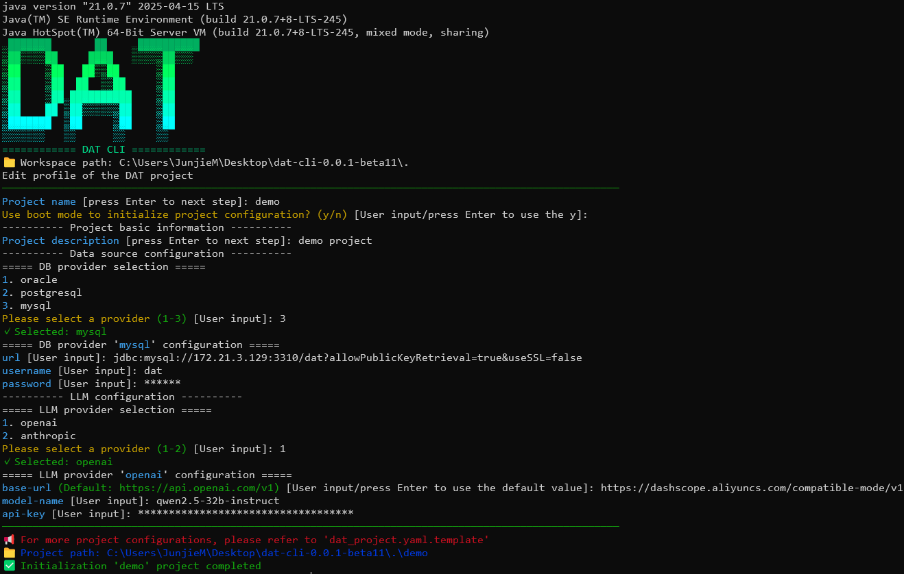

#### 3️⃣ 配置数据源

编辑生成的 `dat_project.yaml`:

```yaml
version: 1
name: my-dat-project
description: 我的第一个智能问数项目

# 数据库配置
db:
  provider: mysql
  configuration:
    url: jdbc:mysql://localhost:3306/mydb
    username: your_username
    password: your_password
    timeout: 1 min

# LLM配置
llm:
  provider: openai
  configuration:
    api-key: your-openai-api-key
    model-name: gpt-4
    base-url: https://api.openai.com/v1

# 嵌入模型配置
embedding:
  provider: bge-small-zh-v15-q
```

>  **提示** ：
> 
> 如果你没有现成的数据可以使用，你可以执行seed命令加载初始化项目中示例的种子数据入库。
>
> ```
> # 加载种子数据
> dat seed -p ./my-dat-project
> ```
> 
> 然后跳过第4️⃣步，使用初始化项目中示例的语义模型，进行第5️⃣步 “开始智能问数”。


#### 4️⃣ 创建语义模型

在 `models/` 目录下创建 `sales.yaml`:

```yaml
version: 1

semantic_models:
  - name: sales_data
    description: 销售数据分析模型
    model: ref('sales_table')
    entities:
      - name: product_id
        description: 产品ID
        type: primary
    dimensions:
      - name: sale_date
        description: 销售日期
        type: time
        type_params:
          time_granularity: day
      - name: region
        description: 销售区域
        type: categorical
        enum_values:
          - value: "North"
            label: "北区"
          - value: "South"
            label: "南区"
    measures:
      - name: sales_amount
        description: 销售金额
        agg: sum
      - name: order_count
        description: 订单数量
        agg: count
```

#### 5️⃣ 开始智能问数

```bash
# 启动交互式问数
dat run -p ./my-dat-project -a default

# 或启动API服务
dat server openapi -p ./my-dat-project
```

现在您可以用自然语言查询数据了！

```
💬 请问北区上个月的销售金额是多少？
📊 正在分析您的问题...
🔍 生成语义SQL: SELECT SUM(sales_amount) FROM sales_data WHERE region='North' AND sale_date >= '2024-11-01'
✅ 查询结果: 北区上个月销售金额为 ¥1,234,567
```


---

## 🛠️ CLI 命令详解

### 📖 命令概览

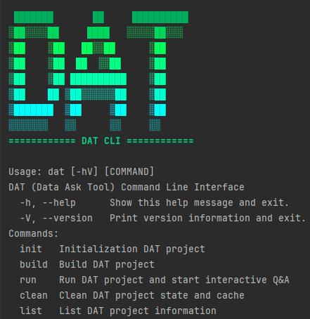

### 🎯 核心命令

#### 🚀 `dat init` - 项目初始化

```bash
dat init --help
```
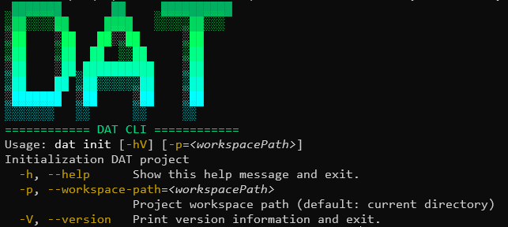

**使用示例**:
```bash
# 交互式初始化DAT项目到当前工作目录下
dat init

# 交互式初始化DAT项目到指定项目工作空间目录下
dat init -w ./my-workspace
```

#### 🤖 `dat run` - 智能问数

```bash
dat run --help
```
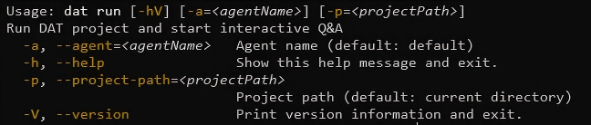

**使用示例**:
```bash
# 当前工作目录为DAT项目目录并启动默认代理
dat run

# 当前工作目录为DAT项目目录并启动特定代理
dat run -a sales-agent

# 指定DAT项目目录并启动特定代理
dat run -p ./my-project -a sales-agent
```


#### 🌐 `dat server` - 服务部署

```bash
dat server --help
```
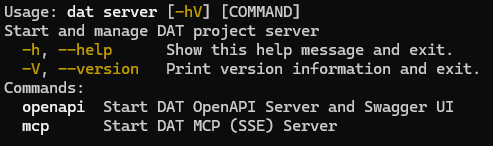

##### 🔌 OpenAPI 服务

```bash
dat server openapi --help
```
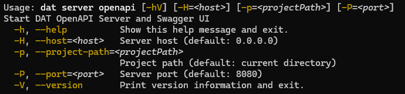

**启动服务**:
```bash
# 当前工作目录为DAT项目目录
dat server openapi

# 指定DAT项目目录
dat server openapi -p ./my-project

# 自定义端口
dat server openapi --port=9090
```

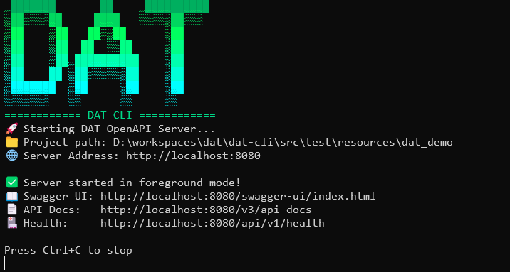

**Swagger UI界面**:
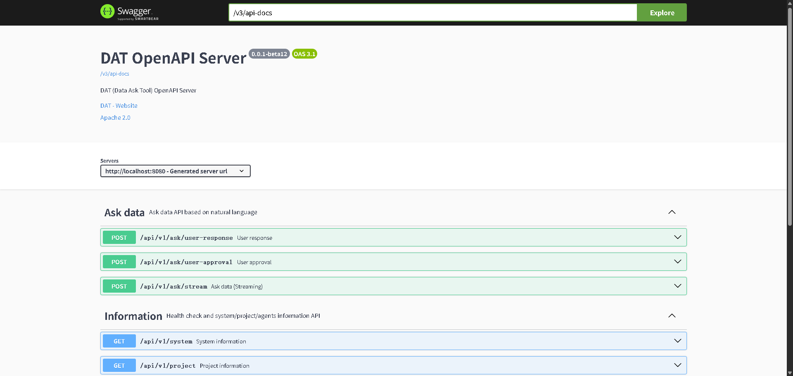

**API调用示例**:
```bash
# 流式问答API
curl -X POST http://localhost:8080/api/v1/ask/stream \
  -H "Content-Type: application/json" \
  -d '{"question": "各个国家的病例总数"}' \
  --no-buffer
```

##### 🔗 MCP 服务

```bash
dat server mcp --help
```
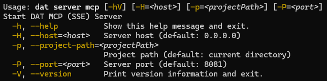

**启动服务**:
```bash
# 当前工作目录为DAT项目目录
dat server mcp

# 指定DAT项目目录
dat server mcp -p ./my-project

# 自定义端口
dat server mcp --port=9091
```

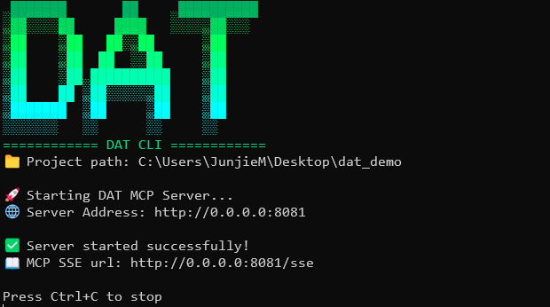


#### 🌱 `dat seed` - 加载种子数据

```bash
dat seed --help
```
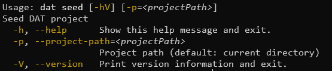

**使用示例**:
```bash
# 当前工作目录为DAT项目目录并加载种子CSV文件
dat seed

# 指定DAT项目目录并加载种子CSV文件
dat seed -p ./my-project
```

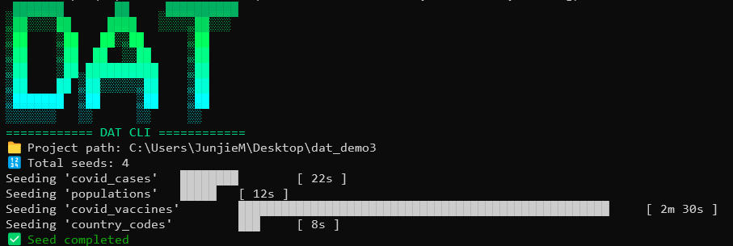


---

## 🏗️ 开发指南

### 📦 模块架构

DAT采用模块化设计，每个模块职责清晰：

```
dat-parent/
├── 🧠 dat-core/           # 核心接口和工厂管理
├── 🔌 dat-adapters/       # 数据库适配器
│   ├── dat-adapter-mysql/
│   ├── dat-adapter-postgresql/
│   └── dat-adapter-oracle/
├── 🤖 dat-llms/          # LLM集成模块
│   ├── dat-llm-openai/
│   └── dat-llm-anthropic/
├── 📊 dat-embedders/     # 嵌入模型集成
│   ├── dat-embedder-bge-small-zh/
│   ├── dat-embedder-bge-small-zh-q/
│   ├── dat-embedder-bge-small-zh-v15/
│   ├── dat-embedder-bge-small-zh-v15-q/
│   └── dat-embedder-openai/
├── 💾 dat-storers/       # 向量存储后端
│   ├── dat-storer-duckdb/
│   └── dat-storer-weaviate/
├── 🎭 dat-agents/        # 智能代理实现
│   └── dat-agent-agentic/
├── 📡 dat-servers/       # 服务端组件
│   ├── dat-server-mcp/
│   └── dat-server-openapi/
├── 🛠️ dat-cli/           # 命令行工具
└── 📚 dat-sdk/           # 开发工具包
```

### 🔧 本地开发环境

#### 环境准备
```bash
# 克隆项目
git clone https://github.com/junjiem/dat.git
cd dat

# 安装依赖并编译
mvn clean install -DskipTests
```

---

## 🤝 贡献指南

我们欢迎所有形式的贡献！无论是bug报告、功能建议、文档改进还是代码提交。

### 🐛 报告问题

在提交issue之前，请确保：

1. **搜索现有问题** - 避免重复提交
2. **提供详细信息** - 包含错误日志、配置文件、复现步骤
3. **使用问题模板** - 帮助我们快速理解问题

### 💡 提交功能建议

我们鼓励创新想法！提交功能建议时请包含：

- **用例说明** - 解决什么实际问题
- **设计思路** - 初步的实现想法
- **影响范围** - 对现有功能的影响评估

### 🔧 代码贡献

#### 开发流程

1. **Fork项目** 并创建功能分支
```bash
git checkout -b feature/awesome-new-feature
```

2. **遵循代码规范**:
   - 使用中文注释解释业务逻辑
   - 遵循阿里巴巴Java编码规范
   - 保持测试覆盖率 > 80%

3. **提交代码**:
```bash
git commit -m "feat: 添加ClickHouse数据库适配器

- 实现ClickHouse连接和查询功能
- 添加SQL方言转换支持
- 完善单元测试覆盖
- 更新相关文档

Closes #123"
```

4. **创建Pull Request**:
   - 详细描述改动内容
   - 关联相关issue
   - 确保CI检查通过

#### 代码审查标准

- ✅ **功能完整性** - 实现符合需求规格
- ✅ **代码质量** - 遵循设计模式和最佳实践
- ✅ **测试覆盖** - 包含单元测试和集成测试
- ✅ **文档更新** - 同步更新相关文档
- ✅ **向后兼容** - 不破坏现有API

### 🎯 开发事项列表

- 1、数据模型（表或视图）的配置；
- 2、语义模型（与数据模型绑定）的配置，包括：实体、维度、度量等；
- 3、基于LLM的生成语义SQL，将语义SQL转真实SQL，最后执行返回数据；
- 4、智能问数支持 HITL (Human-in-the-Loop) 交互；
- 5、支持将智能问数项目对外提供OpenAPI的服务；
- 6、支持将智能问数项目对外提供MCP的服务；
- 7、支持seed命令可以将CSV文件初始化加载入数据库；
- 8、基于LLM的数据探查辅助生成语义模型；（TODO）
- 9、数据模型、语义模型、智能问数的单元测试；（TODO）
- 10、SQL问答对、同义词、业务知识等向量化入库与检索；（TODO）
- 11、指标的配置（构建语义模型后可以更进一步添加指标）；（TODO）


---

## 🌟 社区与支持

### 💬 交流渠道

- **GitHub Discussions** - 技术讨论和问答
- **微信群** - 添加微信 `JEROME1234` 加入社区群

### 🏆 贡献者致谢

感谢所有为DAT项目做出贡献的开发者！

<a href="https://github.com/junjiem/dat/graphs/contributors">
  
</a>

---

## 📊 项目统计

### ⭐ Star历史

[](https://star-history.com/#junjiem/dat&Date)

---

## 📄 许可证

本项目采用 Apache 2.0 许可证。详情请参阅 [LICENSE](https://github.com/junjiem/dat/blob/main/LICENSE) 文件。

---

<div align="center">

**🎯 让数据查询变得简单自然**

**⭐ 如果这个项目对您有帮助，请给我们一个Star！**

[🚀 快速开始](#-快速开始) • [📖 使用文档](https://github.com/junjiem/dat) • [💬 加入社区](#-社区与支持) • [🤝 参与贡献](#-贡献指南)

---

*Built with ❤️ by the DAT Community*

</div>

